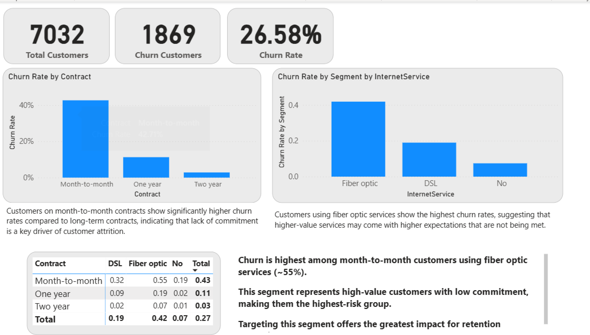

# Customer Churn Analysis (Machine Learning)

This project analyzes customer churn behavior to identify the main factors that drive customer attrition.

The objective is to understand why customers leave and how this information can be used to improve retention strategies.

---

## Business Problem

Customer churn represents a direct loss of revenue and increased acquisition costs.

Understanding the factors that influence churn allows companies to take proactive actions to retain customers and improve long-term profitability.

---

## Key Insights

- **Churn is influenced by customer tenure**  
  Customers in early stages are more likely to leave.

- **Monthly charges impact churn**  
  Higher monthly costs are associated with increased churn risk.

- **Contract type is a strong driver**  
  Month-to-month customers show significantly higher churn compared to long-term contracts.

- **Customer profile matters**  
  Variables such as payment method and service type contribute to churn behavior.

---

## Modeling Approach

- Data preprocessing and feature encoding  
- Logistic Regression as baseline model  
- Evaluation using ROC AUC and classification metrics  
- Model interpretation using feature coefficients  

---

## Model Performance

The model achieves a ROC AUC of approximately **0.90**, indicating strong ability to distinguish between churn and non-churn customers.

However, performance must be interpreted carefully, as real-world deployment depends on threshold selection and business objectives.

---

## Feature Interpretation

The model identifies several key drivers of churn:

- Customers with **fiber optic service** show higher churn risk  
- **Electronic check payment method** is associated with higher churn  
- **Short tenure** strongly increases the probability of churn  
- **Month-to-month contracts** are the highest risk segment  

These patterns are consistent with the exploratory data analysis, reinforcing the reliability of the model.

---

---

## Dataset

Telco Customer Churn Dataset  
https://www.kaggle.com/datasets/blastchar/telco-customer-churn

The dataset is not included due to size and licensing considerations.

---

## Key Takeaway

This project demonstrates that churn prediction is not only about model performance, but about understanding customer behavior and translating insights into actionable retention strategies.
